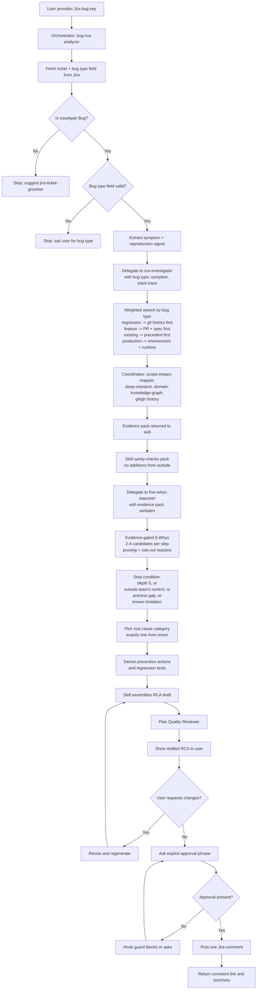
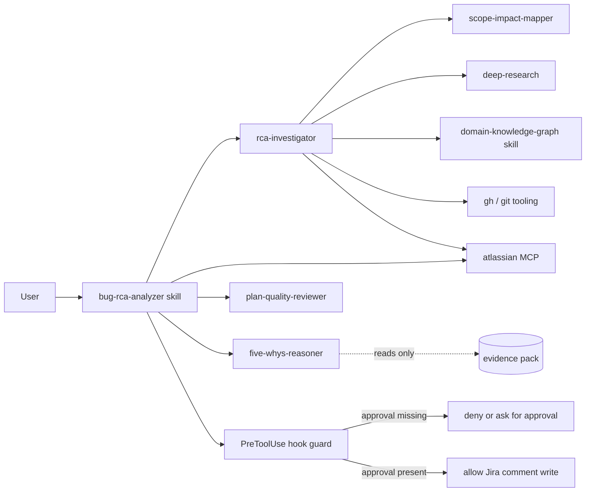

# Bug RCA Architecture

This document describes the end-to-end architecture and control flow for the bug root-cause-analysis (RCA) workflow in this plugin.

Sibling doc: [grooming agent architecutre.md](./grooming%20agent%20architecutre.md) covers the forward-planning grooming workflow. This doc covers the backward-reasoning RCA workflow.

## Scope

The workflow starts from a Jira bug key, reads the bug type from the ticket, delegates all evidence gathering to a single investigator subagent, delegates causal reasoning to a separate reasoner subagent, iterates with user feedback on the drafted RCA, and posts a Jira comment only after explicit approval.

Grooming plans forward work from a requirement. RCA reasons backward from a symptom. Sharing subagents is fine; conflating the workflows is not - if a ticket is a feature/story, the skill hands off to `jira-ticket-groomer` instead.

## Entry Points

- Skill: `bug-rca-analyzer <BUG-KEY>`
- Auto-triggered by phrases like "RCA for TDP-99", "why did TDP-99 happen", "root cause of TDP-99"

## Classifications

Two fixed enums drive the workflow. Exactly one value from each must land in every RCA.

**Bug type** - read from the Jira ticket field, decided at intake:
- Regression bug
- Feature bug
- Existing bug
- Production bug

**Root cause category** - chosen by the reasoner from the terminal step's evidence at the end of the 5-Whys:
- Code error
- Configuration error
- Data error
- Design error
- Existing Bug (distinct from bug type "Existing bug" - see the skill for the disambiguation)
- Requirement error
- Test error
- Dependency issue

## High-Level Flow

## Component Graph

Key structural properties:

- **rca-investigator** is a coordinator subagent - it internally calls the source-specialist subagents (`scope-impact-mapper`, `deep-research`) and the `domain-knowledge-graph` skill, then merges their outputs into one evidence pack. The main conversation only sees the merged result.
- **five-whys-reasoner** has `tools: ['read']` only. It cannot search, cannot call MCPs, cannot open uncited files. This is the structural anti-hallucination guard: any claim it makes has to trace to an artifact already in the pack.
- **The skill** owns the human-facing steps (ticket fetch, symptom extraction, draft assembly, approval, Jira post) and never runs source-specific searches itself.

## Control Gates

1. **Bug-type gate**
   - The workflow halts at intake if the Jira bug type field is missing or not one of the four allowed values. The user is asked; the skill does not infer.

2. **Issuetype gate**
   - If the ticket is not a Bug, the skill stops and suggests `jira-ticket-groomer` instead.

3. **Iteration gate**
   - The orchestrator keeps refining the RCA until the user confirms the drafted content is final.

4. **Write gate**
   - Jira writes are guarded by hooks and require the explicit approval phrase:
     `APPROVE_JIRA_COMMENT <TICKET-KEY>`

5. **Single-side-effect rule**
   - Only one final Jira comment is posted after final approval. No status transitions, no priority changes, no new tickets filed.

6. **One RCA per invocation**
   - The skill does not silently start analyzing linked or similar tickets. Precedent is cited as evidence, not chained into fresh RCAs.

## Data Sources

- Jira ticket details, bug type field, and comments
- Jira historical bugs in two groups (via `rca-investigator` -> `deep-research`):
  - Tagged matches (labels/components/fix versions/links)
  - Untagged matches (semantic keyword/symptom/module similarity)
- Confluence documentation and postmortems
- Local and cross-repo code signals (`scope-impact-mapper`, `gh search code`)
- Change history (`git log`, `git blame`, PR discussions via `gh`)
- Shipped domain knowledge graph (offline, from `semantic-memory/`) for expected behavior
- Runtime error data (Sentry/Datadog/Azure Monitor) - **not currently wired**, referenced under Not found when the ticket points at those dashboards

## Output Contract

The final RCA posted to Jira contains exactly these sections, in order:

- **Symptom** - one sentence + verbatim stack trace or error message if any
- **Bug type** - one label from the bug-type enum
- **Reproduction and environment** - steps, environment, first-seen, impact scope
- **Affected code area** - files/modules with one-line relevance each
- **Expected behavior** - cited from the domain knowledge graph
- **Change history** - commits/PRs with one-line notes, or "tooling unavailable"
- **Precedent bugs and postmortems** - split into Tagged matches and Untagged matches
- **5-Whys chain** - per step: effect, candidates with evidence, picked cause, pruned candidates with rule-out reasons; ending with depth reached and stop reason
- **Candidate root cause** - one or two sentences; trigger and root cause labeled if both apply
- **Root cause category** - exactly one label from the enum, with a one-line justification
- **Prevention actions** - checklist, each `- [ ] <action> - <rationale> (<citation>)`
- **Regression tests to add** - checklist, each `- [ ] <test description> - covers <cause> (<file path>)`
- **Open questions** - the union of the investigator's Not found section, the reasoner's Reasoning gaps section, and anything the ticket implies but does not state

Every bullet in every section either carries a citation from the investigator's pack (or the reasoner's chain over that pack) or lives under **Open questions** - there is no third category.

## Safety and Governance

- Both subagents are read-only.
- `five-whys-reasoner`'s tool restriction (`read` only) is enforced by Copilot's runtime, not just its prompt - it structurally cannot fetch new evidence.
- `rca-investigator` cannot pick the root cause category; the reasoner cannot search for new evidence. This separation of concerns is deliberate.
- The workflow does not transition status, mutate other Jira fields (assignee, labels, priority, sprint), or file follow-up tickets.
- Posting is restricted to a final approved comment on the same ticket, gated by the same `PreToolUse` hook that guards the grooming workflow.
