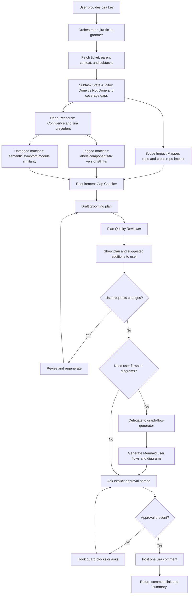
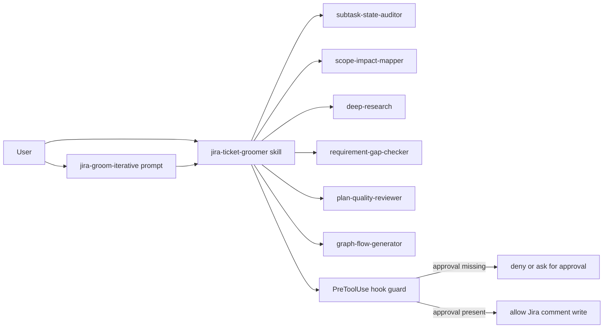

# Jira Grooming Architecture

This document describes the end-to-end architecture and control flow for the iterative Jira grooming workflow in this plugin.

Sibling doc: [bug-rca-architecture.md](./bug-rca-architecture.md) covers the backward-reasoning bug RCA workflow.

## Scope

The workflow starts from a Jira ticket key, performs multi-source analysis with specialized subagents, iterates with user feedback on missing requirements, and posts a Jira comment only after explicit approval.

## Entry Points

- Skill: `jira-ticket-groomer <KEY>`
- Slash command: `/jira-groom-iterative <KEY>`

## High-Level Flow

## Component Graph

## Control Gates

1. Iteration gate
- The orchestrator keeps refining the plan until the user confirms the drafted content is final.

2. Write gate
- Jira writes are guarded by hooks and require explicit approval phrase:
- `APPROVE_JIRA_COMMENT <TICKET-KEY>`

3. Single-side-effect rule
- Only one final Jira comment is posted after final approval.

## Data Sources

- Jira ticket details and subtasks
- Jira historical bugs/tickets in two groups:
  - Tagged matches
  - Untagged matches
- Confluence documentation
- Local and cross-repo code signals

## Output Contract

The final plan should include:

- Impacted areas
- Business and domain context
- Current subtask status (Done vs Not Done)
- Related documentation and precedent (tagged and untagged)
- Suggested additions
- Task breakdown
- Open questions

If requested by the user, also include:

- User flows (Mermaid)
- Technical diagrams such as sequence/component/state flow (Mermaid)

## Safety and Governance

- Subagents are read-only.
- The workflow does not transition status or mutate other Jira fields.
- Posting is restricted to a final approved comment.
